# DALPHI


#### DALPHI Active Learning Platform for Human Interaction

#HSLIDE

## Motivation

- Supervised Machine Learning needs annotated data
- Existing training data are
  - often outdated
  - in military context
  - too universal or too specific
- Need to generate own training data
- Existing solutions are time consuming and exhausting
- ... and as such expensive

#HSLIDE

## Example:<br />Named Entity Recognition

- Inconvenient available annotation interfaces
- Mostly with linguistic focus
- Only whole document views
- Distribution to annotators done manually

#VSLIDE

### GATE


#VSLIDE

### brat rapid annotation tool


#VSLIDE

### WebAnno


#HSLIDE

<ul>
  <li style="margin-bottom: 2rem;">
    To solve these problems, we restructured the way annotations are done fundamentally.
  </li>
  <li class="fragment" style="margin-bottom: 2rem;">
    We designed an iterative workflow to automate as much as we can and to save annotator's attention.
  </li>
  <li class="fragment">
    And created the OpenSource project Dalphi.
  </li>
</ul>

#HSLIDE

## Dalphi

- Web application, runs everywhere
- Helps building and maintaining annotated data
- Key features:
  - Iterating active learning supported workflow framework
  - Human readable presentation
  - Server side to propose useful annotations
  - Parallel distribution to annotators
  - Problem-agnostic document handling

#HSLIDE

## Terminology

- Service
- Raw data
- Annotation document
- Statistic
- Interface
- Project

#VSLIDE

### Service


- *any system* capable of communicating over HTTP
- maintaining *problem specific* jobs
- three types:
	- Iterate
	- Merge
	- Machine Learning

#VSLIDE

### Raw data

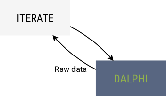

- data that needs *to be annotated*

#VSLIDE

### Raw data

`JSON`  
```
{
	"foo": "bar",
	"foobar": 1.23
}
```

`HTML`  
```
<h1>Impressum</h1>
<p>3antworten UG (haftungsbeschränkt)<br>Karl-Kunger Straße 64<br>12435 Berlin</p>
```

`JPG`  


#VSLIDE

### Annotation document


- a *subset* of raw data
- document which is *renderable* and *annotable*

#VSLIDE

### Statistic

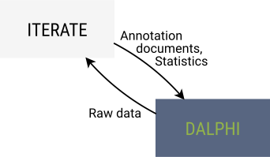

- *key-value* pair
- mostly chronological numeric values

#VSLIDE

### Interface


- *problem specific* user interface
- renders an annotation document as a subset of raw data

#VSLIDE

### Project

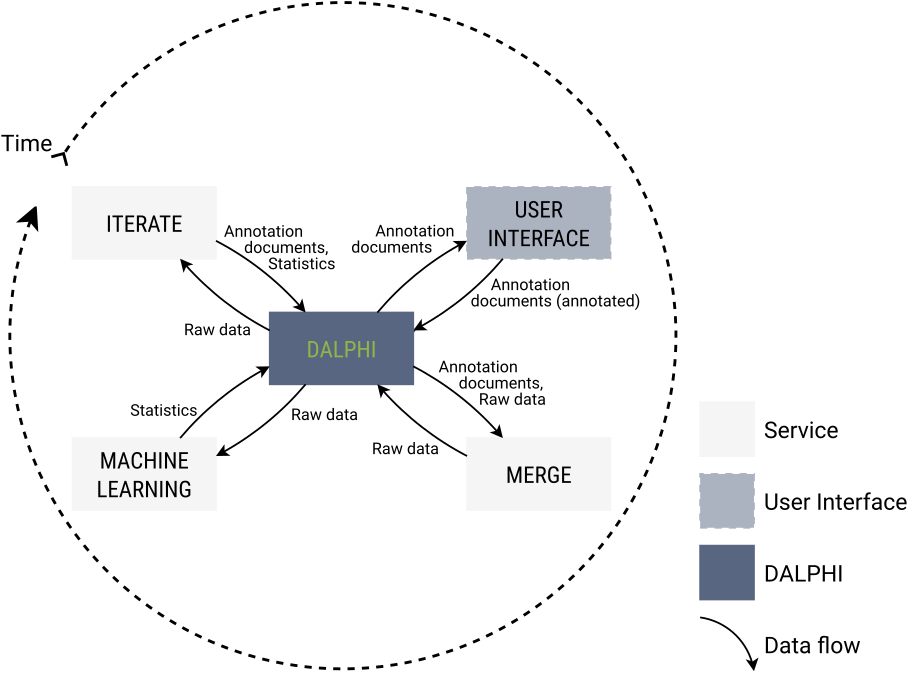

#HSLIDE

#### Projects

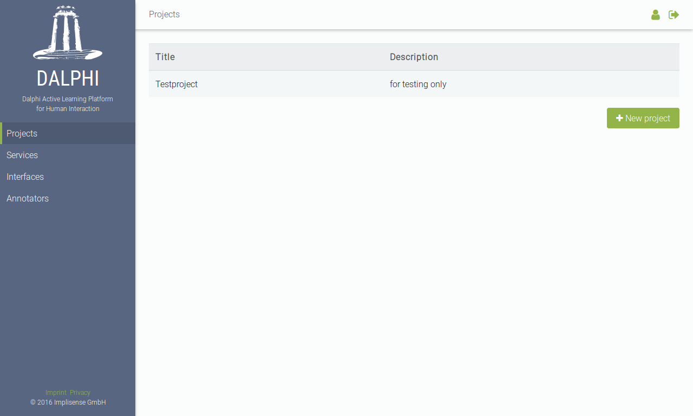

#VSLIDE

#### Dashboard


#VSLIDE

#### Raw data

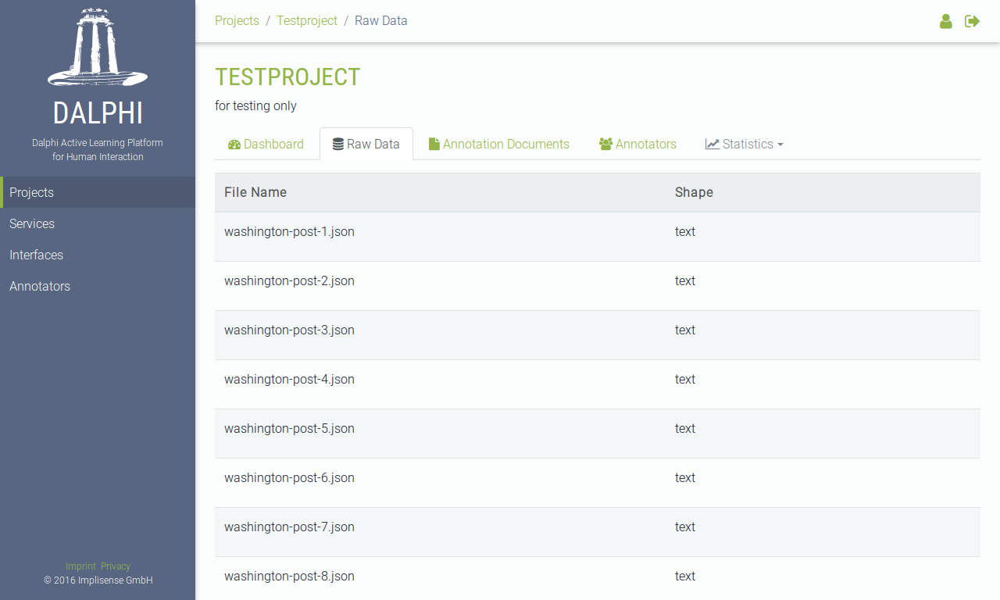

#VSLIDE

#### Edit raw datum


#VSLIDE

#### Annotation documents

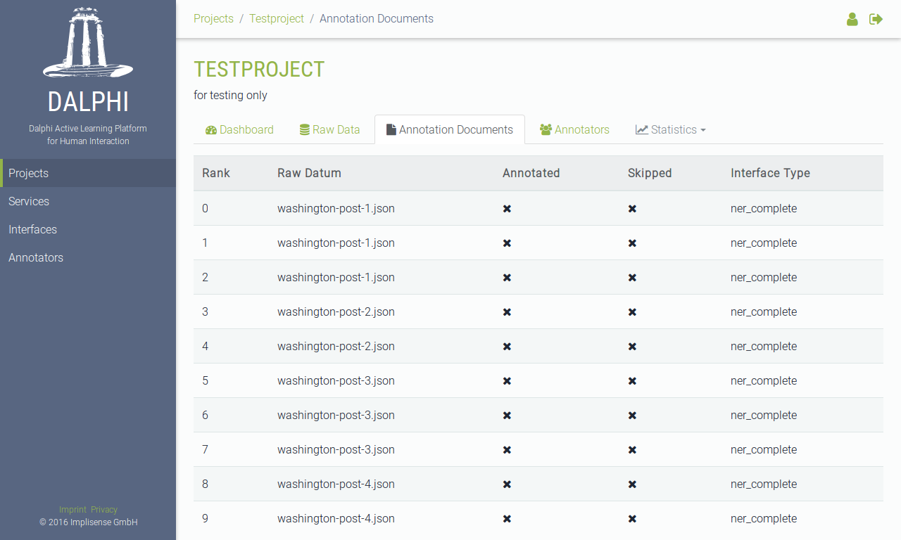

#VSLIDE

#### Show annotation document

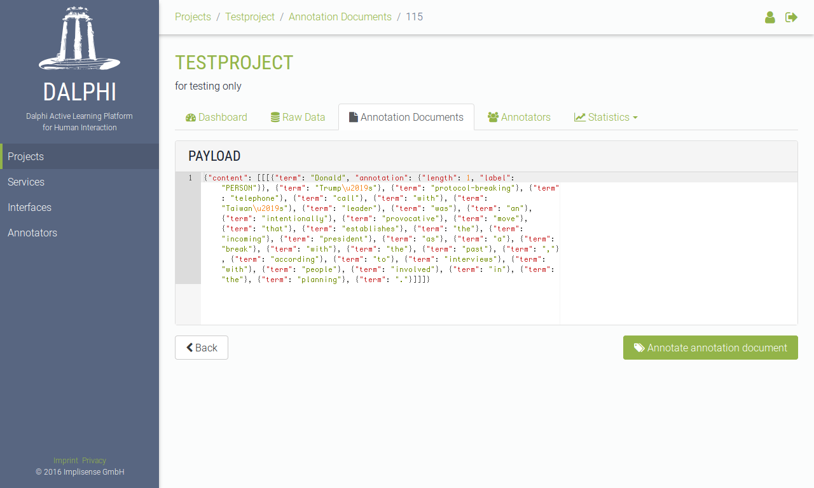

#VSLIDE

#### Annotators


#VSLIDE

#### Show Annotator


#VSLIDE

#### Statistics table


#VSLIDE

#### Statistics graph

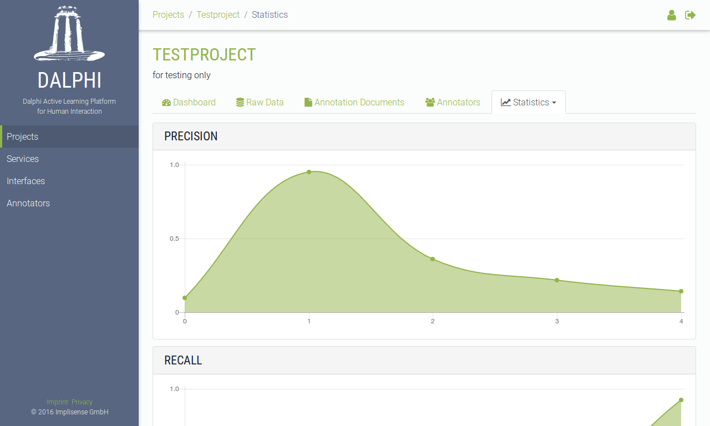

#HSLIDE

#### Services

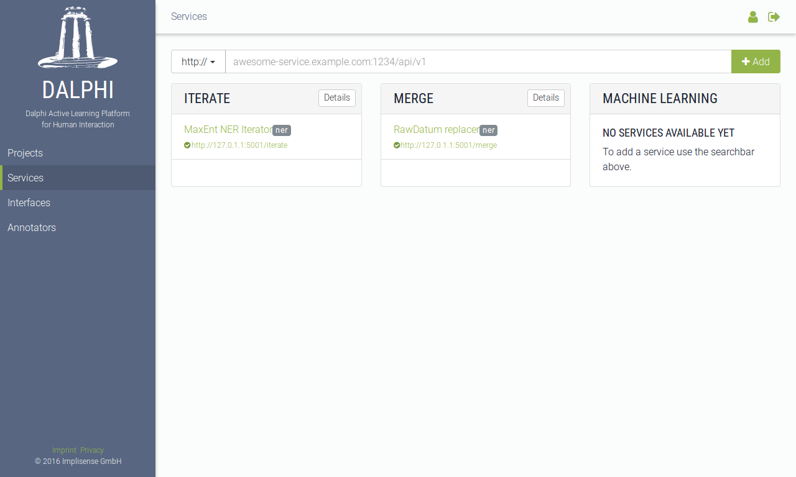

#VSLIDE

#### Edit service


#HSLIDE

#### Interfaces

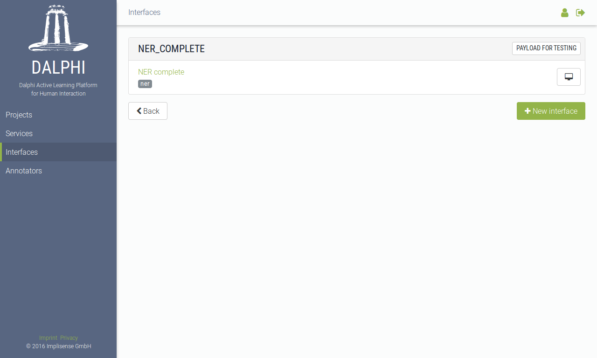

#VSLIDE

#### Edit Interface


#VSLIDE

#### Test Interface

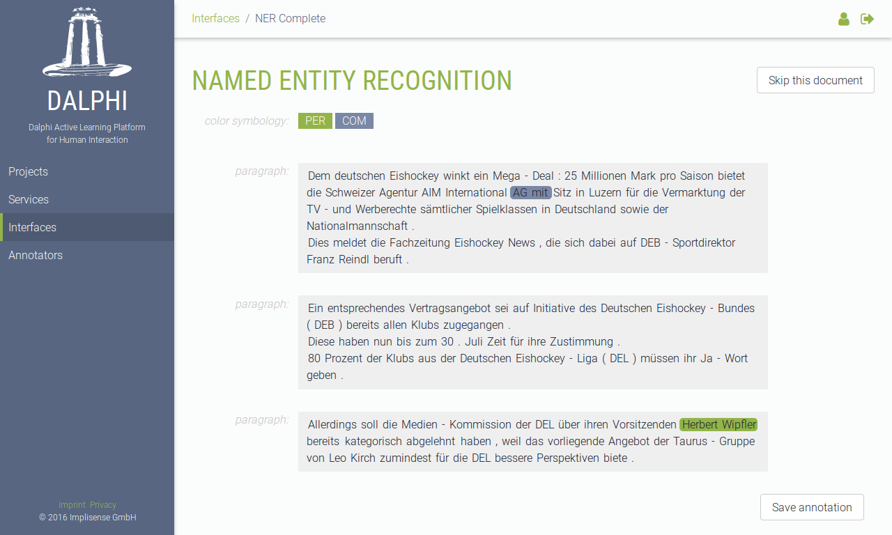

#HSLIDE

#### Annotators


#VSLIDE

#### Edit Annotator


