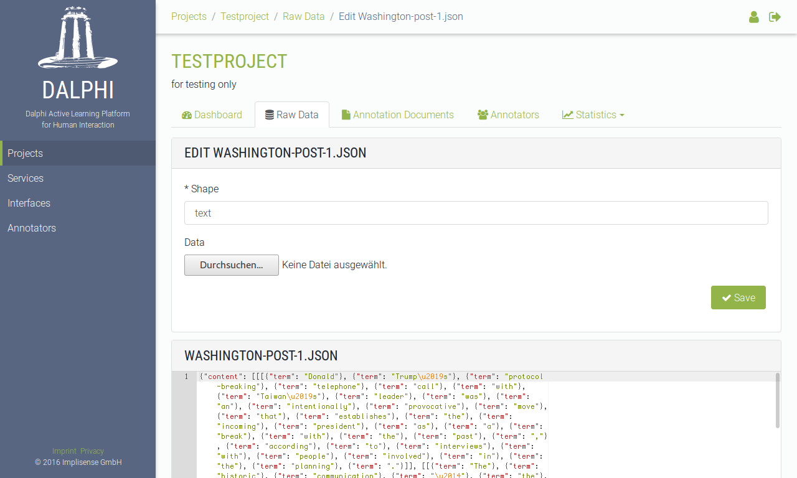
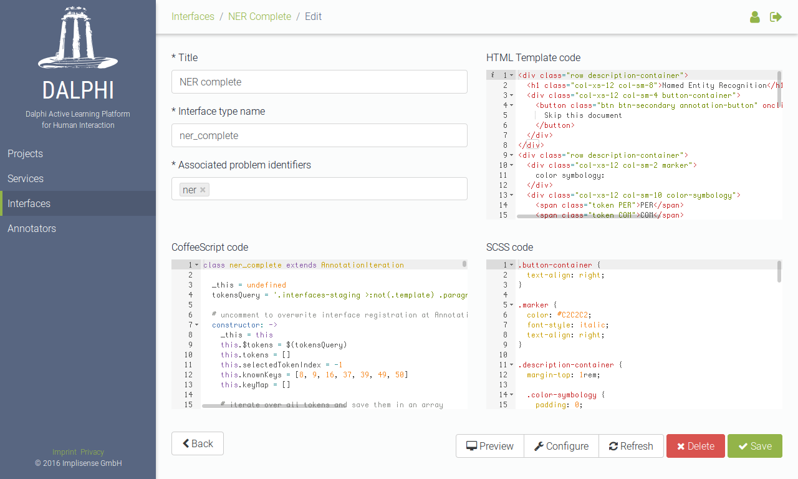

# Introduction


---

## Motivation

...

---

## Terminology

- Raw data
- Annotation document
- Project
- Service
- Interface


### Raw data

- data that needs *to be annotated*

`raw-data.json`  
```
{
	"foo": "bar",
	"foobar": 1.23
}
```

`raw-data.html`  
```
<h1>Impressum</h1>
<p>3antworten UG (haftungsbeschränkt)<br>Karl-Kunger Straße 64<br>12435 Berlin</p>
```

`raw-data.jpg`  


### Annotation document

- a *subset* of raw data
- document which is *renderable* and *annotable*


### Interface

- *problem specific* user interface
- renders an annotation document as a subset of raw data


### Service

- *any system* capable of communicating over HTTP
- maintaining *problem specific* jobs
- three types:
	- Iterate
	- Merge
	- Machine Learning


### Project

...

---

## Dalphi

- Ruby on Rails application

---

#### Projects


#### Dashboard


#### Raw data


#### Edit raw datum




#### Annotation documents


#### Show annotation document


#### Statistics table


#### Statistics graph


---

#### Services


#### Edit service


---

#### Interfaces


#### Edit Interface


