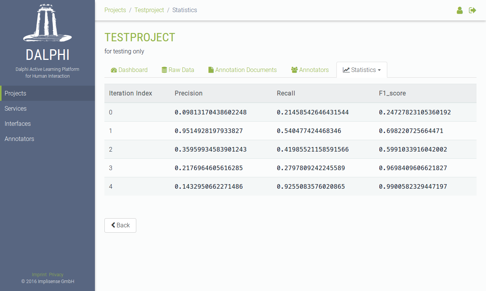
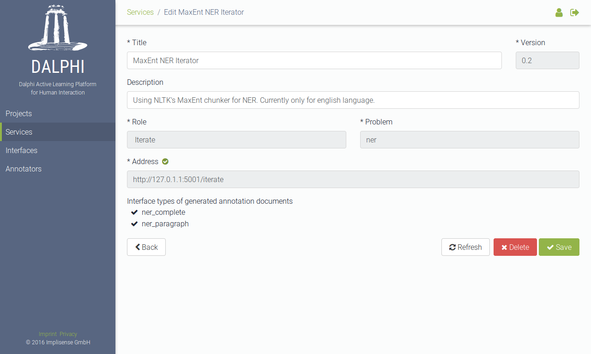

# DALPHI


#### DALPHI Active Learning Platform for Human Interaction

---

## Motivation

- Supervised Machine Learning needs annotated data
- Dalphi helps building and maintaining annotated data
- Key features:
  - Human readable presentation
  - Parallel distribution to annotators
  - Problem-agnostic document handling

---

### Example
## Named Entity Recognition

- Inconvenient available annotation interfaces
- Mostly with linguistic focus
- Only whole document views
- No active server side to propose useful annotations
- Distribution to annotators done manually


### GATE


### brat rapid annotation tool


### WebAnno


---

## Terminology

- Service
- Raw data
- Annotation document
- Statistic
- Interface
- Project


### Service


- *any system* capable of communicating over HTTP
- maintaining *problem specific* jobs
- three types:
	- Iterate
	- Merge
	- Machine Learning


### Raw data


- data that needs *to be annotated*


### Raw data

`JSON`  
```
{
	"foo": "bar",
	"foobar": 1.23
}
```

`HTML`  
```
<h1>Impressum</h1>
<p>3antworten UG (haftungsbeschränkt)<br>Karl-Kunger Straße 64<br>12435 Berlin</p>
```

`JPG`  


### Annotation document


- a *subset* of raw data
- document which is *renderable* and *annotable*


### Statistic


- *key-value* pair
- mostly chronological numeric values


### Interface


- *problem specific* user interface
- renders an annotation document as a subset of raw data


### Project


---

## Dalphi

- Ruby on Rails application

---

#### Projects


#### Dashboard


#### Raw data


#### Edit raw datum


#### Annotation documents


#### Show annotation document


#### Statistics table




#### Statistics graph


---

#### Services


#### Edit service



---

#### Interfaces


#### Edit Interface


#### Test Interface


